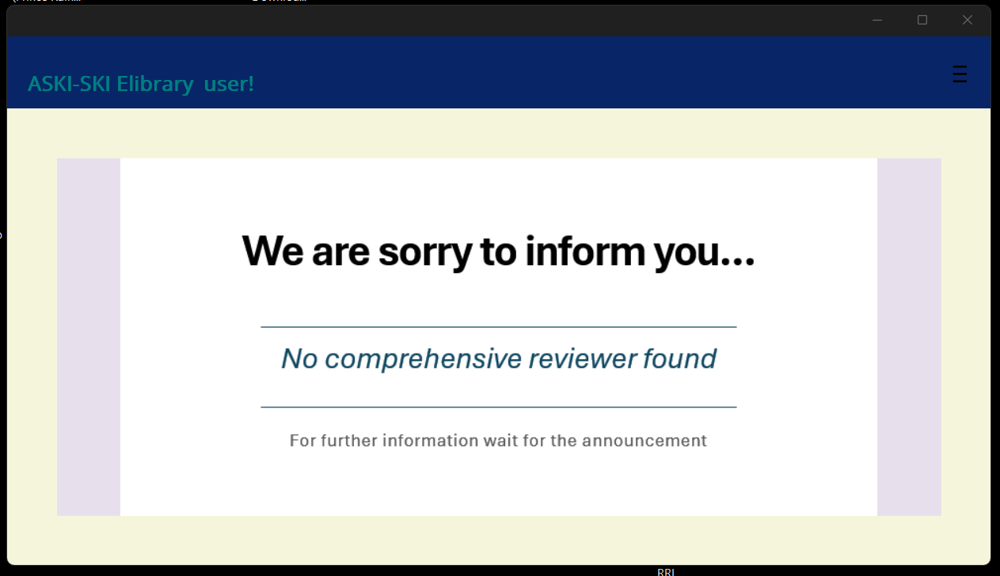

# 🚫 This Project Has Been Discontinued

> **Status:** Not a finished project — rejected and abandoned as of September 21, 2025.
>
> Go to [#ℹ️ Key Notes](#ℹ️-key-notes) to find more information about the project's current state.

# 📚 ASKI-SKI eLibrary (by SSG 12-ICT Representative)

> I am the one and only Developer of this project
>
> This repo is dedicated to the E-Library created for Students of ASKI-SKI.
> A cross-platform **.NET MAUI** mobile and desktop application designed for **ASKI-SKI students** to access digital reviewers, e-books, and personal notes powered by **Supabase**.

---

## 🧭 Overview

The **ASKI-SKI eLibrary** is a student-built educational platform that brings together learning materials, announcements, and file previews in one simple app.
Developed using **.NET MAUI**, it runs on **Windows** and **Android**, syncing resources from the cloud via **Supabase REST APIs**.

---

## ✨ Features

* 🔐 **Login & Account Management** — Secure access with user authentication  ✅
* 📘 **Reviewers & eBooks** — View PDF materials fetched directly from Supabase Storage  ✅
* 🗂️ **Personal Notes** — Create and organize personal study notes  ❌
* 📢 **Announcements Page** — Admins can post and manage announcements  ✅
* 🔍 **Search and Filter** — Quickly find materials  ❌
* 🌗 **Modern UI** — Responsive design with dark/light mode (in progress)
* ⚙️ **Offline Cache** — Previously opened PDFs stay accessible  ✅

---

## 🛠️ Tech Stack

| Layer          | Technology                 |
| -------------- | -------------------------- |
| Frontend / App | .NET MAUI (.NET 8 LTS)     |
| UI             | XAML + C#                  |
| Backend        | Supabase REST API          |
| Storage        | Supabase Storage (PDFs)    |
| Viewer         | Syncfusion MAUI PDF Viewer |
| Database       | PostgreSQL (Supabase)      |

---

## Supported Platforms

> **No Apple devices supported**

| 📱Mobile      | 💻Windows         | 🐧💻Linux   |
| ------------- | ----------------- | ----------- |
| ✅ Android 13+ | ✅ Windows 10 & 11 | ⚠️ Untested |

---

## ℹ️ Key Notes

> As of October 7, 2025, the project will not be continued and will be abandoned.

The project started on **August 21, 2025**, as a proposed platform. It was not approved initially, but development began early to maximize time before the scheduled **release date of October 1, 2025**, for Alpha Testing. Sadly, it was **rejected on September 21, 2025**. The project was nearly ready to launch, with only minor adjustments pending. Once the proposal was rejected, **it was abandoned and no further progress has been made since then.**

---

## 📱 Screenshots (Preview)

   
  <em>This is the login page</em>

---

   
  <em>This is the sidebar</em>

---

   
  <em>This is the home page</em>

---

   
  <em>This is the eBooks page</em>

---

   
  <em>This is the reviewer page</em>

---

### 🎥 Demo Video
> GitHub doesn’t preview videos directly in Markdown.  
> To watch the demo, click the link below:

[▶️ Watch Demo Video](demovidpic/video.mp4)

---

## 👨‍💻 Developer Info

Developed by **Prince Rainier Apolonio**
**SSG 12-ICT Representative, ASKI-SKI**
📅 Development Period: August 21 – September 21, 2025
📍 Location: Talavera, Nueva Ecija
